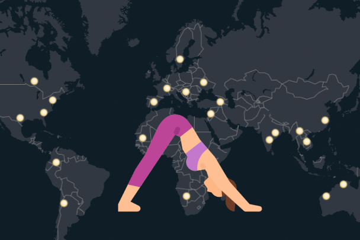
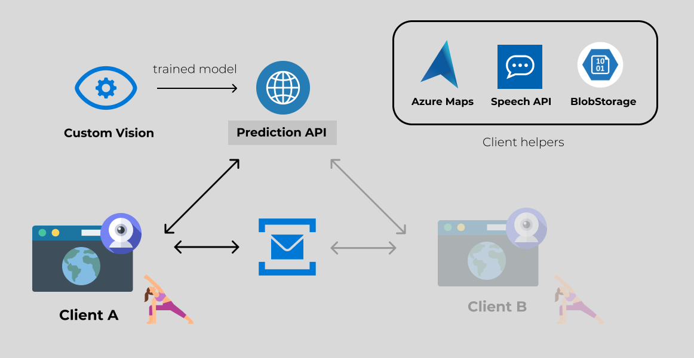
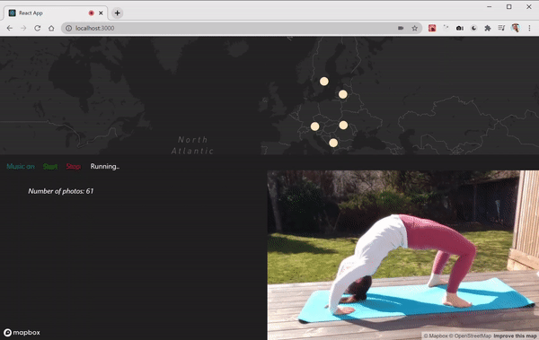

# yogaCam: Live map



The yogaCam Live Map is a web application for users to keep on while practicing yoga that will recognize and visualize all ongoing activity of a certain yoga pose in real-time. On a map, each individual sees a bright spot for all other people who do the same pose at that moment. Change pose and marvel at the new group of people you share the moment with around the world.

## Repo Details

High level directory structure for this repository:

```bash
├── frontend                  <- Web app built with React.js
├── azure                     <- Azure related code
│   ├── AzureResourceGroup    <- ARM template for the solution in Azure.
├── images                    <- Images used in the documentation
```

## System architecture




## Frontend

Apart from a set of more general packages as _typescript_ and _react_, the following Node packages were used:
```bash
react-azure-maps
react-webcam
@azure/storage-blob
@azure/service-bus
microsoft-cognitiveservices-speech-sdk
```

# Reproduce

### Azure Requirements

First, create an [Azure Account](https://portal.azure.com) and a  resource group. Then, create the following resources in Azure portal or use the provided ARM template.

### Resources:  
1. [Azure Maps](https://portal.azure.com) 
2. [Custom Vision Service](https://docs.microsoft.com/en-us/azure/cognitive-services/custom-vision-service/)
3. [Speech API (text-to-speech)](https://docs.microsoft.com/en-us/azure/cognitive-services/speech-service/text-to-speech)
4. [Azure Storage Account](https://docs.microsoft.com/en-us/azure/storage/common/storage-account-overview) with [Blob containers](https://docs.microsoft.com/en-us/azure/storage/blobs/)  
4. [Service Bus Topic](https://docs.microsoft.com/en-us/azure/service-bus-messaging/service-bus-queues-topics-subscriptions)

### Local dev envrioment
1. Code edidor ([Visual Studio Code](https://code.visualstudio.com/) recommended)
2. [Node.js](https://nodejs.org/en/)
3. [Azure SDK for JavaScript](https://azure.github.io/azure-sdk-for-js/)

Some app settings and tokens are needed for the client to authenticate towards the services. Create a file named _.env_ and specify then. To find the keys, enter repective resource in the Azure portal. 

```bash
REACT_APP_CUSTOMVISION_KEY=<yourValue>
REACT_APP_SPEECH_KEY=<yourValue>
REACT_APP_SPEECH_REGION=<yourValue>
REACT_APP_SERVICE_BUS_CONNECTION=<yourValue>
REACT_APP_STORAGE_TOKEN=<yourValue>
REACT_APP_STORAGE_NAME=<yourValue>
REACT_APP_AZURE_MAP_KEY=<yourValue>
REACT_APP_AZURE_STORAGE_BUS=<yourValue>
```

## Demo 



## Next up 

- Running inference locally  
- Finalize the flow of real-time data between clients
- Being able to extend classes for the model (seamless! If the model doesn't recognize a certain pose, use the Azure AI **speech-to-text** to tell the application to start saving new training data for the specified pose while performing it)

## Credits 

- open source packages listed in the Frontend section
- dataset provided by [Anastasia Marchenkova](https://www.amarchenkova.com/2018/12/04/data-set-convolutional-neural-network-yoga-pose/) (however I both filtered and extented the dataset)
- yoga illustrations created by [monik](https://www.flaticon.com/search?word=yoga&author_id=249)